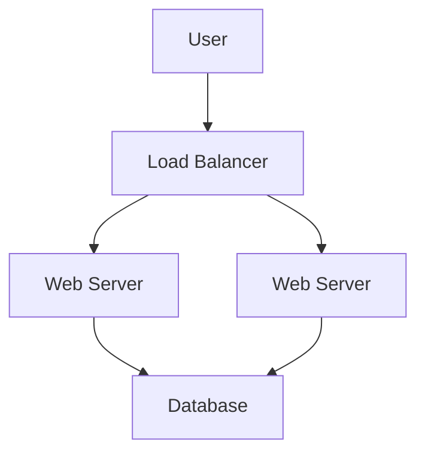

# DevOps Best Practices

## Overview
This document outlines the best practices for DevOps and infrastructure work.

## Infrastructure as Code

### Principles

1. **Idempotency**: Running the same code multiple times produces the same result
2. **Immutability**: Replace rather than modify resources
3. **Declarative**: Define desired state, not how to achieve it
4. **Version Control**: All infrastructure code in git

### Terraform Best Practices

```hcl
# Use workspaces for environments
terraform workspace select dev

# Organize with modules
module "vpc" {
  source = "../../modules/vpc"
}

# Use variables for environment differences
variable "environment" {
  default = "dev"
}

# Tag all resources
tags = {
  Environment = var.environment
  ManagedBy   = "Terraform"
}
```

## CI/CD

### Pipeline Design

1. **Fast feedback**: Run tests early and fail fast
2. **Parallel execution**: Run independent steps in parallel
3. **Idempotent**: Pipelines should be rerunnable
4. **Secure**: Never expose secrets in logs

### GitHub Actions Best Practices

```yaml
# Reusable workflows
jobs:
  build:
    uses: ./.github/workflows/reusable-build.yml
    with:
      app: myapp

# Composite actions
- name: Setup build
  uses: ./.github/actions/setup-build

# Caching
- uses: actions/cache@v3
  with:
    path: node_modules
    key: ${{ runner.os }}-node-${{ hashFiles('**/package-lock.json') }}
```

## Kubernetes

### Resource Management

```yaml
# Always set resource requests and limits
resources:
  requests:
    memory: "128Mi"
    cpu: "100m"
  limits:
    memory: "256Mi"
    cpu: "200m"

# Use health checks
livenessProbe:
  httpGet:
    path: /health
    port: 8080
  initialDelaySeconds: 30
  periodSeconds: 10

readinessProbe:
  httpGet:
    path: /ready
    port: 8080
  initialDelaySeconds: 5
  periodSeconds: 5
```

### Configuration Management

```yaml
# Use ConfigMaps for configuration
apiVersion: v1
kind: ConfigMap
metadata:
  name: app-config
data:
  APP_ENV: "production"
  LOG_LEVEL: "info"

# Use Secrets for sensitive data
apiVersion: v1
kind: Secret
metadata:
  name: app-secrets
type: Opaque
data:
  DB_PASSWORD: <base64-encoded>
```

## Monitoring

### Metrics

1. **RED Method**: Rate, Errors, Duration
2. **USE Method**: Utilization, Saturation, Errors
3. **Golden Signals**: Latency, Traffic, Errors, Saturation

### Prometheus Best Practices

```yaml
# Use meaningful labels
http_requests_total{method="POST", endpoint="/api/users", status="200"}

# Alert on symptoms, not causes
alert: HighErrorRate
expr: rate(http_requests_total{status=~"5.."}[5m]) > 0.05

# Use recording rules for complex queries
groups:
  - name: api_rules
    rules:
      - record: job:http_requests_total:rate5m
        expr: sum(rate(http_requests_total[5m])) by (job)
```

## Security

### Secrets Management

1. **Never in code**: Use vault or environment variables
2. **Rotate regularly**: Automate secret rotation
3. **Principle of least privilege**: Grant minimum required access
4. **Audit access**: Log all secret access

### Terraform Security

```hcl
# Use encrypted state
terraform {
  backend "s3" {
    encrypt = true
  }
}

# Validate with tfsec
# Scan with checkov

# Use IAM roles
provider "aws" {
  assume_role {
    role_arn = "arn:aws:iam::123456789012:role/TerraformRole"
  }
}
```

## Cost Optimization

### Right-sizing

```hcl
# Use appropriate instance types
resource "aws_instance" "app" {
  instance_type = var.environment == "prod" ? "t3.medium" : "t3.micro"
}

# Use auto-scaling
resource "aws_autoscaling_group" "app" {
  min_size = 2
  max_size = 10
  desired_capacity = 4
}
```

### Savings Opportunities

1. **Reserved Instances**: For steady workloads
2. **Spot Instances**: For fault-tolerant workloads
3. **Lifecycle policies**: For old data
4. **Tagging**: For cost allocation

## Disaster Recovery

### Backup Strategy

```bash
# Regular backups
kubectl get deployments -n production -o yaml > backup-$(date +%Y%m%d).yaml

# Test restores
kubectl apply -f backup-20250110.yaml --dry-run=client
```

### High Availability

1. **Multi-AZ**: Deploy across availability zones
2. **Multi-region**: For critical applications
3. **Health checks**: Automated failover
4. **Backups**: Regular and tested

## Documentation

### Required Documentation

- Architecture diagrams
- Runbooks for common scenarios
- Onboarding guides
- Change logs
- Incident reports

### Diagrams



## Resources

- [Terraform Best Practices](https://www.terraform-best-practices.com/)
- [Kubernetes Documentation](https://kubernetes.io/docs/)
- [Google SRE Book](https://sre.google/sre-book/table-of-contents/)
